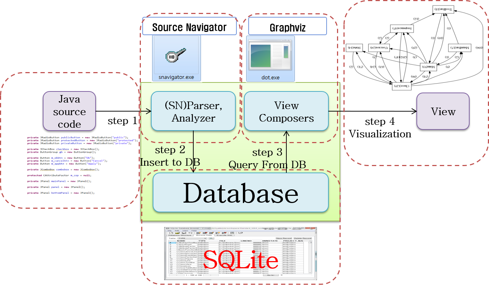

# Tool-chain for Software Visualization
아래과 같은 도구로 Tool-chain을 구성한다.

* Source Navigator

소스 네비게이터는 파서로써 소스 코드를 스캔하고 기존 C, C++, Java, Tcl, FORTRAN, COBOL 등과 같은 프로그램에서 정보를 추출하여 dbdump를 생성한다.

* SQLite

소스 네이게이터를 통해 분석된 데이터를 데이터베이스화 하는데 SQLite를 사용한다.

* Graphviz (Dot Script)

소프트웨어 품질 지표나 출력하고 싶은 정보를 Dot 스크립트를 작성하여 그래프화 시켜주는 도구이다.

## Getting Started

자바, C/C++과 같은 프로그램을 소스 네비게이터를 통해 구문 분석을 하고, 그 결과로 나온 SNDB 파일을 SQLite 데이터베이스에 저장하고 필요한 정보를 추출하여 Dot 스크립트를 통해 그래프로 소프트웨어 가시화를 한다. 

### Installing

SWV에서 전체 필요한 프로그램을 설치했는데, 혹시라도 누락된 경우가 있다면 아래와 같이 설치를 하면 된다. 리눅스에 SQLite는 기본으로 설치되어 있으므로 따로 설치방법을 설명하지 않고, Source Navigator, Graphviz만 설명한다. SWV에서 디렉토리 구성을 모두 했으므로 아래와 같이 따라 한다.
만약 /usr/local/SWV/dev 디렉토리가 없다면, 디렉토리를 생성하고 작업해야 한다.

* Source Nagigator

```bash
# cd /usr/local/SWV/dev
# mkdir SNavi
# cd SNavi
# wget https://sourceforge.net/projects/sourcenav/files/NG4.5/sourcenavigator-NG4.5.tar.bz2
# tar jxf sourcenavigator-NG4.5.tar.bz2
# cd sourcenavigator-NG4.5
# ./configure --prefix=/usr/local/SWV/dev/SNavi
# make
# make install

```

* Graphviz

```bash
# cd /usr/local/SWV/dev
# mkdir graphviz
# cd graphviz
# wget -c http://graphviz.gitlab.io/pub/graphviz/stable/SOURCES/graphviz.tar.gz
# tar -xzvf graphviz.tar.gz
# cd graphviz-2.40.1
# ./configure
# make
# make install

```

* toolchain 소스코드를 github에서 저장소를 복제한다.
복제 위치: /usr/local/SWV/toolchain 이므로 아래와 같이 작성한다. 복제가 끝난 후, 확인하면 본 toolchain 소스코드가 저장된 것을 확인할 수 있다.

```bash
# git clone https://github.com/moasoftware/toolchain.git /usr/local/SWV/toolchain
```

## Running the tests

1. AnnotationTerminator

  - AnnotationTerminator Compile

Source Nagigator 가 Annotaion 기능에 대해 구문분석을 못하므로  소스코드에서 Annotation을 삭제하는 작업이 필요하다.
**"/usr/local/SWV/toolchain/AnnotationTerminator/lib/javaparser-core-3.1.1.jar"** 라이브러리를 포함하여 
**/usr/local/SWV/toolchain/AnnotationTerminator/bin/** 디렉토리에 컴파일한 **.class** 파일을 위치시켜 컴파일하도록 한다.

```bash
# javac -cp "/usr/local/SWV/toolchain/AnnotationTerminator/lib/javaparser-core-3.1.1.jar" -sourcepath src -d /usr/local/SWV/toolchain/AnnotationTerminator/bin/ /usr/local/SWV/toolchain/AnnotationTerminator/src/open/swv/annotation_terminator/*.java

```

* AnnotationTerminator.jar 생성
```bash
추가
```

* AnnotationTerminator 실행

**AnnotationTerminator.jar**는 **/usr/local/SWV/toolchain**에 있다.
분석할 소스코드는 자바로 만든 Chess 프로그램이고, 소스코드는 **/usr/local/SWV/dev/** 하위에 존재한다.
분석할 소스코드가 있는지 꼭 확인하고 아래처럼 실행한다. 절대경로로 실행하는 것은 어느 위치에 있든지 헷갈리지 않고 프로그램을 실행하려는데 목적이 있다.

```bash
java -jar /usr/local/SWV/toolchain/AnnotationTerminator.jar -input /usr/local/SWV/dev/all_java_uci_ce/uci/MagnumChess_v4.00/src/magnumchess -output /usr/local/SWV/dev/src
```
### Break down into end to end tests

Explain what these tests test and why

```
Give an example
```

### And coding style tests

Explain what these tests test and why

```
Give an example
```

## Deployment

Add additional notes about how to deploy this on a live system

## Built With

* [Dropwizard](http://www.dropwizard.io/1.0.2/docs/) - The web framework used
* [Maven](https://maven.apache.org/) - Dependency Management
* [ROME](https://rometools.github.io/rome/) - Used to generate RSS Feeds

## Contributing

Please read [CONTRIBUTING.md](https://gist.github.com/PurpleBooth/b24679402957c63ec426) for details on our code of conduct, and the process for submitting pull requests to us.

## Versioning

We use [SemVer](http://semver.org/) for versioning. For the versions available, see the [tags on this repository](https://github.com/your/project/tags). 

## Authors

* **Billie Thompson** - *Initial work* - [PurpleBooth](https://github.com/PurpleBooth)

See also the list of [contributors](https://github.com/your/project/contributors) who participated in this project.

## License

This project is licensed under the MIT License - see the [LICENSE.md](LICENSE.md) file for details

## Acknowledgments

* Hat tip to anyone whose code was used
* Inspiration
* etc
